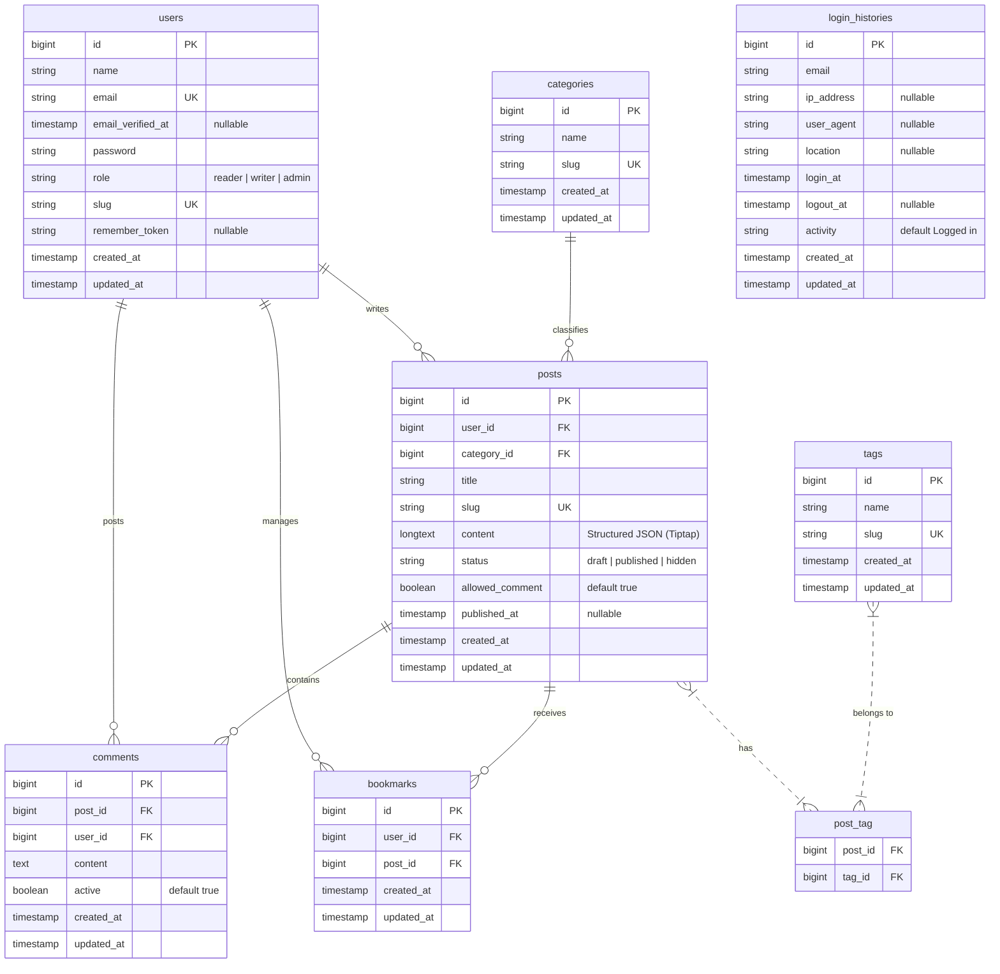

# LaraBlog — Database ERD & Application Architecture

This document outlines the architectural standards, structural designs, and data modeling definitions powering the LaraBlog CMS blog platform.

---

## 📊 Entity Relationship Diagram (ERD)

The LaraBlog database is structured on a clean, highly relational, and normalized schema designed for integrity and query efficiency under high read loads.

---

## 🗄️ Database Tables Schema & Metadata

### 1. `users`

Represents the system users. Authentication and RBAC (Role-Based Access Control) are determined by the `role` column.

- `id` (BIGINT, PK, Auto Increment)
- `name` (VARCHAR)
- `email` (VARCHAR, Unique Index)
- `password` (VARCHAR)
- `role` (VARCHAR: `reader`, `writer`, `admin`) — Defaults to `reader` during public registration.
- `slug` (VARCHAR, Unique Index) — Used for clean author routes.
- `remember_token` (VARCHAR, Nullable)

### 2. `posts`

Represents articles created by writers or admins.

- `id` (BIGINT, PK, Auto Increment)
- `user_id` (BIGINT, FK -> `users.id`, Cascade on Delete)
- `category_id` (BIGINT, FK -> `categories.id`, Restrict on Delete)
- `title` (VARCHAR)
- `slug` (VARCHAR, Unique Index) — Generated automatically from the title.
- `content` (LONGTEXT) — Structured JSON format exported from the Tiptap WYSIWYG editor.
- `status` (VARCHAR: `draft`, `published`, `hidden`) — Defaults to `draft`.
- `allowed_comment` (BOOLEAN, default: `true`) — Toggles public commenting on a per-post basis.
- `published_at` (TIMESTAMP, Nullable) — Tracks when the post went live.

### 3. `categories`

Hierarchical taxonomies for dynamic grouping of posts.

- `id` (BIGINT, PK, Auto Increment)
- `name` (VARCHAR)
- `slug` (VARCHAR, Unique Index)
- _Integrity Rule:_ Categories cannot be deleted if they contain active posts, unless those posts are first reassigned or deleted.

### 4. `tags`

Dynamic, flat labels attached to posts.

- `id` (BIGINT, PK, Auto Increment)
- `name` (VARCHAR)
- `slug` (VARCHAR, Unique Index)

### 5. `post_tag` (Pivot)

Join table representing the Many-to-Many association between posts and tags.

- `post_id` (BIGINT, FK -> `posts.id`, Cascade on Delete)
- `tag_id` (BIGINT, FK -> `tags.id`, Cascade on Delete)

### 6. `comments`

Sub-resource comments written on published articles.

- `id` (BIGINT, PK, Auto Increment)
- `post_id` (BIGINT, FK -> `posts.id`, Cascade on Delete)
- `user_id` (BIGINT, FK -> `users.id`, Cascade on Delete)
- `content` (TEXT)
- `active` (BOOLEAN, default: `true`) — Allows admins to toggle comment visibility.

### 7. `bookmarks`

Join table tracking posts saved by readers.

- `id` (BIGINT, PK, Auto Increment)
- `user_id` (BIGINT, FK -> `users.id`, Cascade on Delete)
- `post_id` (BIGINT, FK -> `posts.id`, Cascade on Delete)

### 8. `login_histories`

Audit log tracking user authentication patterns and sessions.

- `id` (BIGINT, PK, Auto Increment)
- `email` (VARCHAR)
- `ip_address` (VARCHAR, Nullable)
- `user_agent` (VARCHAR, Nullable)
- `location` (VARCHAR, Nullable)
- `login_at` (TIMESTAMP)
- `logout_at` (TIMESTAMP, Nullable) — Managed dynamically on explicit logouts or calculated session expirations.
- `activity` (VARCHAR, default: `Logged in`) — Can become `Logged out` or `Session expired`.

---

## 🔑 Role & Permissions Matrix

LaraBlog enforces strict Role-Based Access Control (RBAC) via the `RoleMiddleware` and `IsAdmin` middleware.

| Feature / Action                       |        Guest         | Reader (Default) |      Writer      |          Admin          |
| :------------------------------------- | :------------------: | :--------------: | :--------------: | :---------------------: |
| Browse homepage, read posts, search    |        🟢 Yes        |      🟢 Yes      |      🟢 Yes      |         🟢 Yes          |
| Leave comments on published articles   | 🔴 Redirect to Login |      🟢 Yes      |      🟢 Yes      |         🟢 Yes          |
| Bookmark / Unbookmark articles         | 🔴 Redirect to Login |      🟢 Yes      |      🟢 Yes      |         🟢 Yes          |
| Access Dashboard Home & Analytics      |   🔴 403 Forbidden   | 🔴 403 Forbidden |      🟢 Yes      |         🟢 Yes          |
| Write, Edit, Publish personal Articles |   🔴 403 Forbidden   | 🔴 403 Forbidden |      🟢 Yes      |         🟢 Yes          |
| Moderate and Edit _others'_ Articles   |   🔴 403 Forbidden   | 🔴 403 Forbidden | 🔴 403 Forbidden |         🟢 Yes          |
| Admin Category CRUD management         |   🔴 403 Forbidden   | 🔴 403 Forbidden | 🔴 403 Forbidden |         🟢 Yes          |
| Admin Comment Moderation / Deletion    |   🔴 403 Forbidden   | 🔴 403 Forbidden | 🔴 403 Forbidden |         🟢 Yes          |
| Admin User Administration / Deletion   |   🔴 403 Forbidden   | 🔴 403 Forbidden | 🔴 403 Forbidden | 🟢 Yes (No Self-Delete) |
| Inspect Login Audit Histories          |   🔴 403 Forbidden   | 🔴 403 Forbidden | 🔴 403 Forbidden |         🟢 Yes          |

---

## 🛠️ Comprehensive Capabilities & Features List

### 1. Cinematic Bento UI/UX

- **Aesthetic-Usability Flow:** Interactive spacing and layout grids utilizing Tailwind CSS v4 and Alpine.js.
- **Rich Micro-Animations:** Cinematic delayed card reveals, tag hovers, slide-out notification panels, and loading spinners powered by the Motion transition engine.
- **Responsive Defaulting:** Smooth transitions across mobile viewports, high-density retina displays, and full widescreen setups.

### 2. Next-Gen Headless Editor

- **Structured Tiptap JSON:** Replaced raw HTML/CKEditor fields to represent the document model as structured JSON, rendering HTML on the fly with the PHP-native `ContentRenderer` service. This prevents complex Cross-Site Scripting (XSS) input vectors completely.
- **Spatie Media Pipeline:** Modern drag-and-drop uploading of hero banners and post graphics. Automatically crops, compresses, generates responsive sizes, and exports files into highly portable WebP formats.

### 3. Real-Time Broadcasting Network

- **Pusher protocol over WebSockets:** Backed by **Laravel Reverb**, bypassing third-party platform dependencies to offer high-throughput local broadcasting.
- **Cinematic Toast Alerts:** Instant audio-visual popup feedback upon receiving comments, article shares, or administrative logs.
- **Navbar Notifications & Multi-Tab Synchronization:** Reading a notification automatically updates counters and dismisses alerts across all open browser tabs simultaneously using live event channels.

### 4. Zero-Loss Category & Tag Merging

- **Dynamic Relational Pivot Tagging:** Users write custom comma-separated words which are normalized into lowercase, slugified models and attached via pivots without duplicates.
- **Category Deletion Protection:** Enforces clean database constraints. Admin users cannot accidentally purge categories containing active articles without explicit re-categorization steps.

### 5. Automated Session Integrity

- **Database-Backed Sessions:** Integrates dynamic state checking.
- **Automated Expiration Cleanup:** Runs an hourly cron task resolving active session lifetimes, finding expired sessions, and logging them out gracefully under audit trails.

---

## 📂 Directory Conventions

LaraBlog adheres to the standard modern Laravel application structure:

- `app/Http/Controllers/`: Handles route orchestrations.
  - `Admin/`: Administrative analytics, profile forms, and historical dashboards.
  - `Home/`: Guest routes, searches, feeds, and articles.
- `app/Http/Middleware/`: Security filters including `RoleMiddleware` and `IsAdmin`.
- `app/Http/Requests/`: FormRequests enforcing static data-type boundaries.
- `app/Livewire/`: Class-based Livewire v4 components managing interactive views:
  - `Admin/`: `ArticleForm`, `CategoryTable`, `CommentTable`, `UserTable`, and `LoginHistoryTable`.
  - `Blog/`: `BookmarkToggle`, `PostComments`.
- `app/Models/`: Eloquent mapping definitions, cast types, and relationships.
- `app/Support/`: Utility engines like `ContentRenderer` and `CustomMediaPathGenerator`.
- `database/migrations/`: Database schema history and updates.
- `routes/`: Clean separating routes (`web.php`, `console.php`, `channels.php`).
